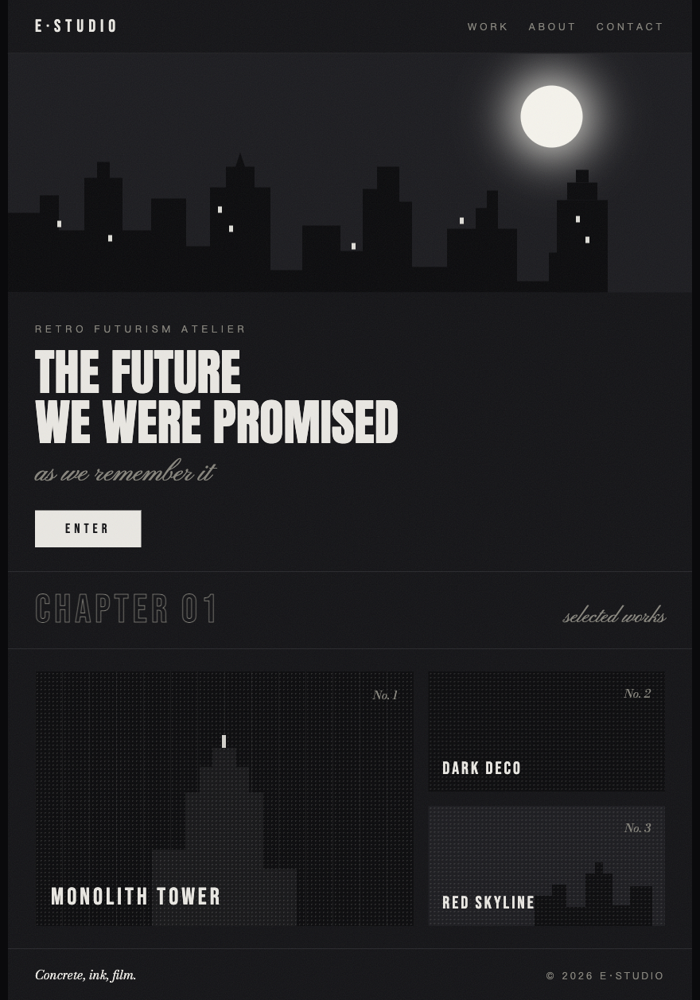
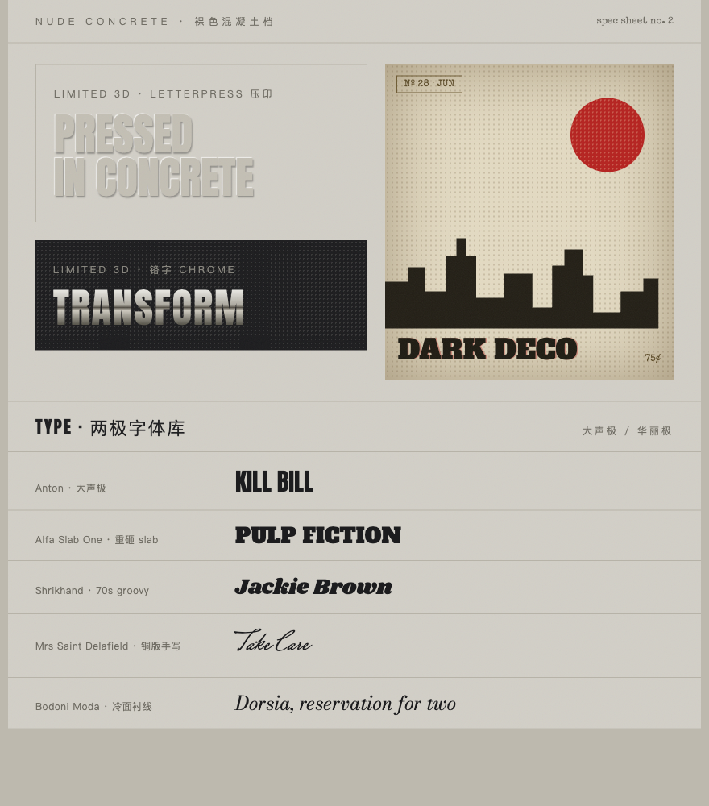

<div align="center">

# personal-taste · 复古未来主义前端品味

[English](./README.md) · `简体中文`

</div>



> 给 AI 一套**我的**审美，而不是所有人的平均审美。

这是一个 [Claude Code](https://claude.com/claude-code) 的 **Agent Skill**：一份可移植的设计规则文件。当 AI 为我生成或重做任何前端界面时，它会自动按这套品味来——而不是收敛成那种千篇一律、紫渐变居中 hero 的"AI 味儿"。

## 设计哲学：复古未来主义

用 20 世纪的材料与手艺，表达对未来的想象。三根支柱：

- **纪念碑性** —— 庄重、厚重、压得住，竖向的崇高感
- **模拟材料** —— 质感来自混凝土、油墨、网点、胶片、纸张的密度，绝不来自数码光泽
- **构建的世界** —— 一切元素经过设计转译（插画、剪影、单色 wash）才许入画，未经处理的"真实"不许进来

一条贯穿始终的口诀：**黑暗里一道光**。全页只许一个发光焦点（或唯一一抹饱和色），其余一切退后。与之相对的反面——"黑暗里处处是光"的科技大屏风——是本 skill 的头号假想敌。

## 它管什么

| 维度 | 一句话 |
|------|--------|
| 色彩 | 无色优于庸色；用色则让一种色相像环境光淹没整页，黑是结构、白是光 |
| 光 | 唯一稀缺光源即视觉重心；辉光合法但必须稀缺 |
| 布局 | 大块面、剪影成立、不对称；直角为主，只接受雕塑感大曲线 |
| 材质 | 哑光为本；做旧印刷、半调网点、胶片颗粒、雕版线刻 |
| 字体 | 两极并立——粗壮 display（大声）与铜版/冷面衬线（华丽）；公敌是中性无衬线当主角 |
| 图像 | 拒绝纪实实拍；插画 / 素描 / 重度处理的摄影才许入画 |
| 动效 | 昆汀法则：静为常态，动则决绝；禁一切漂浮缓动 |

完整规则见 [`SKILL.md`](./SKILL.md)。



## 怎么用

**作为 Claude Code skill：**

```bash
git clone https://github.com/bot-Ethan/personal-taste-skill.git ~/.claude/skills/personal-taste
```

之后让 Claude 做前端时会自动触发。

**用于其它 AI：** 直接把 [`SKILL.md`](./SKILL.md) 的内容贴进对话即可。

## 它是怎么来的

这套品味不是凭空写的，而是从一批跨媒介素材里**蒸馏**出来的：

- **建筑** —— 安藤忠雄的光之教堂、彼得·卒姆托的 LACMA 新馆
- **漫画** —— 20 世纪的老蝙蝠侠（BTAS / Dark Deco）、变形金刚的旧印刷封面
- **电影** —— 昆汀·塔伦蒂诺全系、《美国精神病人》
- **专辑封面** —— A$AP Rocky 的胶片复古、Drake 的铜版字标

跨媒介的好处是：提炼出的风格更独特，不会"像某个网站"。

## 致谢

灵感与结构受 [taste-skill](https://github.com/Leonxlnx/taste-skill) 启发——一个对抗 "AI slop" 的开源前端 skill 项目。本仓库是它的"个人化"分支：不追求通用的好品味，只追求**我的**品味。

## License

[MIT](./LICENSE)
